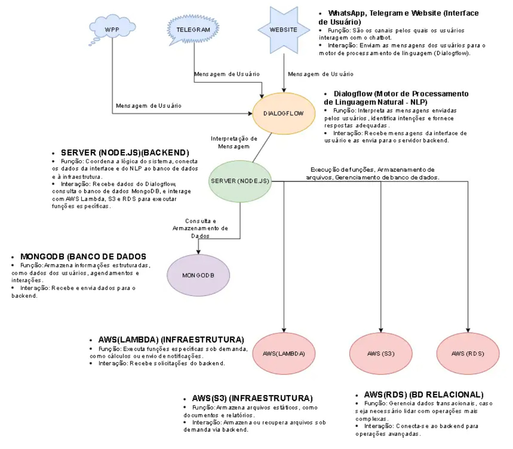

# FIAP - Faculdade de Informática e Administração Paulista

 

# Chatbot Solubio

## Grupo 67

## 👨‍🎓 Integrantes: 
- <a href="https://www.linkedin.com/in/vittor-augusto/">Vitor Augusto Gomes</a>
- <a href="https://www.linkedin.com/company/inova-fusca">João Vitor Lopes Beiro</a>
- <a href="https://www.linkedin.com/company/inova-fusca">Thyego Brandão</a> 
- <a href="https://www.linkedin.com/company/inova-fusca">Lucas Gabriel Alves Costa</a> 
- <a href="https://www.linkedin.com/company/inova-fusca">Vinícius Zeller Matias</a>

## 👩‍🏫 Professores:
### Tutor(a) 
- <a href="https://www.linkedin.com/in/lucas-gomes-moreira-15a8452a/">Lucas Gomes</a>
### Coordenador(a)
- <a href="https://www.linkedin.com/in/profandregodoi/">André Godoi Chiovato</a>

## 📜 Descrição

### Chatbot Dra. Jô ###
O Projeto Solubio é uma solução de chatbot e backend que otimiza o atendimento ao cliente via WhatsApp, Telegram e website, usando NLP (Dialogflow) para interpretar mensagens e fornecer respostas automáticas. Com backend em Node.js e infraestrutura AWS, conecta interfaces de usuário com bancos de dados para gerenciar agendamentos e interações de forma eficiente.

### Objetivo ###
O projeto visa o desenvolvimento de uma solução integrada para atendimento e suporte automatizado, com foco em agendamentos e vendas. A solução utiliza diversas interfaces de usuário, como WhatsApp, Telegram e um website, para oferecer respostas rápidas e personalizadas, melhorando a experiência do usuário e aumentando a eficiência do atendimento.

### Tecnologias Utilizadas ###
* Frontend: Interfaces de usuário para WhatsApp, Telegram e website, que enviam mensagens dos usuários ao sistema.
* NLP (Processamento de Linguagem Natural): Dialogflow, para interpretar as mensagens dos usuários, identificar intenções e fornecer respostas adequadas.
* Backend (Server): Node.js para coordenar a lógica do sistema e integrar os dados entre o Dialogflow, o banco de dados e a infraestrutura AWS.
* Banco de Dados:
   MongoDB: Para armazenamento de informações estruturadas dos usuários, agendamentos e interações.
   AWS RDS: Para gerenciamento de dados transacionais mais complexos.
* Infraestrutura AWS:
   AWS Lambda: Para execução de funções sob demanda, incluindo cálculos e envio de notificações.
   AWS S3: Para armazenamento de arquivos estáticos, como conteúdos e relatórios.

### Arquitetura da Solução ###
1. Interfaces de Usuário:
* WhatsApp, Telegram e Website: Canais de comunicação pelos quais os usuários interagem com o chatbot.
2. Motor NLP (Dialogflow):
* Interpreta as mensagens dos usuários, identificando intenções e enviando os dados para o backend.
3. Backend (Server em Node.js):
* Coordena a lógica do sistema, recebendo dados do Dialogflow, consultando MongoDB e AWS RDS, e interagindo com AWS Lambda e S3 para executar funções específicas.
4. Banco de Dados:
* MongoDB: Armazena dados estruturados dos usuários, agendamentos e histórico de interações.
* AWS RDS: Gerencia dados transacionais complexos, conforme necessário.
5. Infraestrutura AWS:
* AWS Lambda: Executa funções específicas sob demanda.
* AWS S3: Armazena arquivos estáticos necessários para o sistema.

### Custos Previstos e Justificativa ###

1. *Dialogflow (Google Cloud):*
   - *Camada Gratuita:* Permite 1.000 solicitações por mês gratuitamente.
   - *Custo Adicional:* Aproximadamente US$ 0,002 por solicitação adicional.
   - *Justificativa:* Necessário para interpretar mensagens de usuários e fornecer respostas adequadas. O custo dependerá do volume de interações.

2. *MongoDB (Atlas):*
   - *Camada Gratuita:* Oferece até 512 MB de armazenamento.
   - *Custo Adicional:* Planos começam a partir de US$ 9 por mês para maior capacidade.
   - *Justificativa:* Armazena dados de pacientes, interações e agendamentos. A versão gratuita pode ser suficiente para MVPs.

3. *AWS Lambda:*
   - *Camada Gratuita:* 1 milhão de execuções gratuitas por mês.
   - *Custo Adicional:* US$ 0,20 por milhão de solicitações adicionais.
   - *Justificativa:* Executa funções sob demanda, garantindo escalabilidade e eficiência.

4. *AWS S3:*
   - *Camada Gratuita:* 5 GB de armazenamento gratuito por mês.
   - *Custo Adicional:* US$ 0,023 por GB adicional.
   - *Justificativa:* Armazena arquivos estáticos, como documentos e logs.

5. *AWS RDS:*
   - *Camada Gratuita:* 750 horas de uso gratuito por mês (durante 12 meses) e 20 GB de armazenamento.
   - *Custo Adicional:* Planos começam a partir de US$ 15 por mês, dependendo do tipo de banco de dados.
   - *Justificativa:* Gerencia transações e dados estruturados de forma robusta.

6. *WhatsApp Business API:*
   - *Camada Gratuita:* Não possui.
   - *Custo Adicional:* Aproximadamente US$ 0,05 por mensagem.
   - *Justificativa:* Necessário para comunicação direta com pacientes via WhatsApp.

### Diagrama da Arquitetura ###

## 📁 Estrutura de pastas

Dentre os arquivos e pastas presentes na raiz do projeto, definem-se:

- <b>.github</b>: Nesta pasta ficarão os arquivos de configuração específicos do GitHub que ajudam a gerenciar e automatizar processos no repositório.

- <b>assets</b>: aqui estão os arquivos relacionados a elementos não-estruturados deste repositório, como imagens.

- <b>config</b>: Posicione aqui arquivos de configuração que são usados para definir parâmetros e ajustes do projeto.

- <b>document</b>: aqui estão todos os documentos do projeto que as atividades poderão pedir. Na subpasta "other", adicione documentos complementares e menos importantes.

- <b>scripts</b>: Posicione aqui scripts auxiliares para tarefas específicas do seu projeto. Exemplo: deploy, migrações de banco de dados, backups.

- <b>src</b>: Todo o código fonte criado para o desenvolvimento do projeto ao longo das 7 fases.

- <b>README.md</b>: arquivo que serve como guia e explicação geral sobre o projeto (o mesmo que você está lendo agora).

## 📋 Licença

<a property="dct:title" rel="cc:attributionURL" href="https://github.com/agodoi/template">MODELO GIT FIAP</a> por <a rel="cc:attributionURL dct:creator" property="cc:attributionName" href="https://fiap.com.br">Fiap</a> está licenciado sobre <a href="http://creativecommons.org/licenses/by/4.0/?ref=chooser-v1" target="_blank" rel="license noopener noreferrer" style="display:inline-block;">Attribution 4.0 International</a>.

